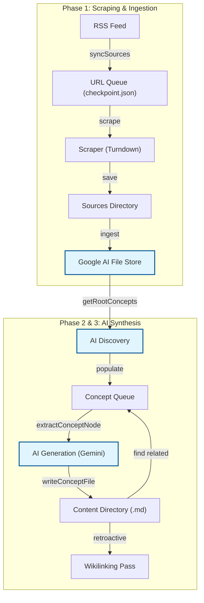

# obenauer.me

> Exploring new and renewed ideas for how personal computing and the interfaces with which we think can better serve people’s lives – expanding opportunity, agency, curiosity, and creativity.

This is the digital garden and research repository for [Alexander Obenauer](https://alexanderobenauer.com), deployed at [obenauer.etok.me](https://obenauer.etok.me). It serves as a living document of core philosophies—Agency, Malleability, Augmentation, and the Itemized OS—and functions as a networked graph of concepts.

[Read the announcement post on Bluesky](https://bsky.app/profile/etok.me/post/3mhbzq5u4xk2f)

Inspired by [this LinkedIn post](https://www.linkedin.com/posts/justin1ee_i-need-to-prove-that-ai-agents-can-do-more-activity-7374804713906606080-nan-/).

The site is powered by [Quartz v4](https://quartz.jzhao.xyz/).

## Core concepts

- **[[item|Itemization]]**: Break down digital silos into atomic, interrelated units.
- **[[graph|The Graph]]**: Move beyond hierarchical folders into a fluid web of triples.
- **[[sovereignty|Sovereignty]]**: Architect personal computing environments that prioritize human agency.
- **[[localfirst|Local-first]]**: Build tools that are fast, private, and owned by the user.

## Getting started

1. **Install dependencies**: `npm install`
2. **Start the development server**: `npm run start`

## Scripts

- `npm run start`: Build and serve the site locally with hot reloading.
- `npm run build`: Build the production site.
- `npm run check`: Run TypeScript type checking and [deno fmt](https://docs.deno.com/examples/deno_fmt/) checking.
- `npm run format`: Format the codebase using [deno fmt](https://docs.deno.com/examples/deno_fmt/).

## Data & intelligence workflow

This project provides a specialized `data` workspace for content processing, scraping, and AI-assisted synthesis.

- `npm run generate`: Process sources and generate concept pages. This performs a full pipeline: syncing from RSS, scraping content, and generating the research graph.
- `npm run generate -- --reload`: Reset the pipeline and regenerate all concepts from scratch.
- `npm run chat`: Interactive CLI for data management and research tasks.

### Pipeline overview

Commands in the `data` workspace use environment variables defined in the root `.env` file.

## License

This project is licensed under the MIT License.

---

Developed with 🧪 by [**@EthanThatOneKid**](https://etok.me/)
